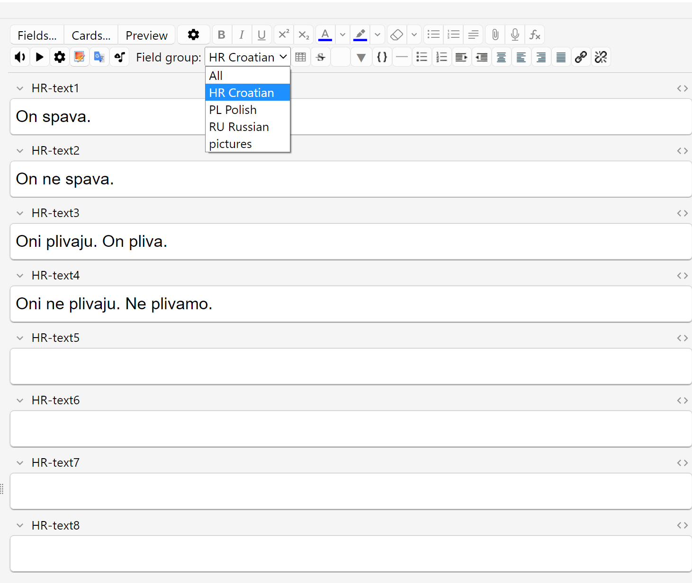

# Field Groups

This Anki add-on allows you to organize notetype fields into custom groups such that only the chosen group of fields is shown in the editor at a time. This is useful if you have notetypes with dozens of fields for some reason.

You can define your field groups in the config under _Tools > Add-ons > Config_.

## Download

You can download the add-on from AnkiWeb: [666404032](https://ankiweb.net/shared/info/666404032)

## Changelog

See [CHANGELOG.md](CHANGELOG.md) for a list of changes.

## Support & feature requests

Please post any questions, bug reports, or feature requests in the [support page](https://forums.ankiweb.net/t/field-groups-organize-editor-fields-into-groups/36420) or the [issue tracker](https://github.com/abdnh/anki-field-groups/issues).

If you want priority support for your feature/help request, I'm available for hire.
You can get in touch from the aforementioned pages, via [email](mailto:abdo@abdnh.net) or on [Fiverr](https://www.fiverr.com/abd_nh).

## Support me

Consider supporting me if you like my work:

I'm also available for freelance add-on development on Fiverr:

